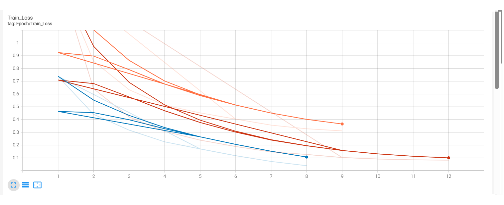
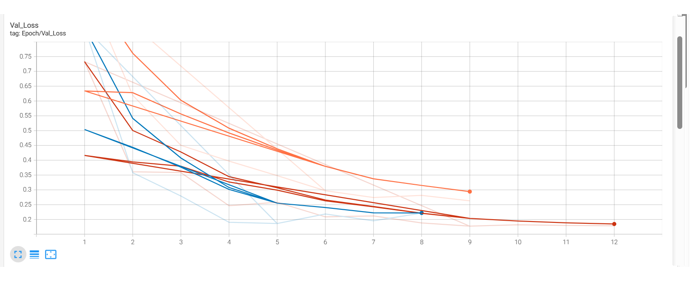
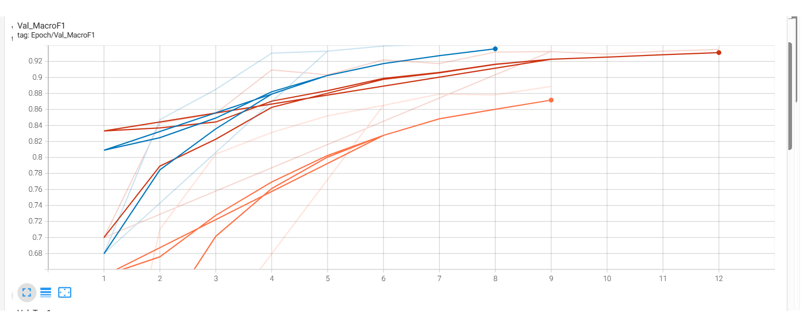
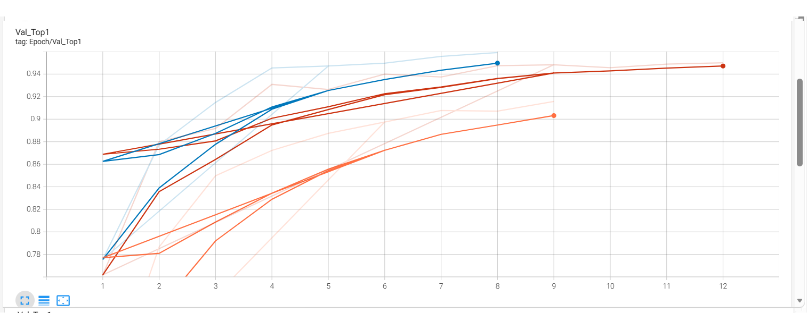
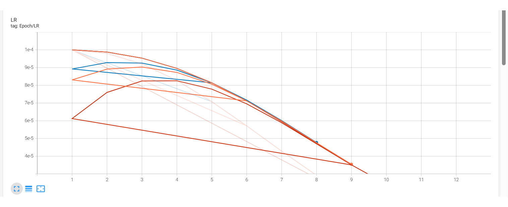
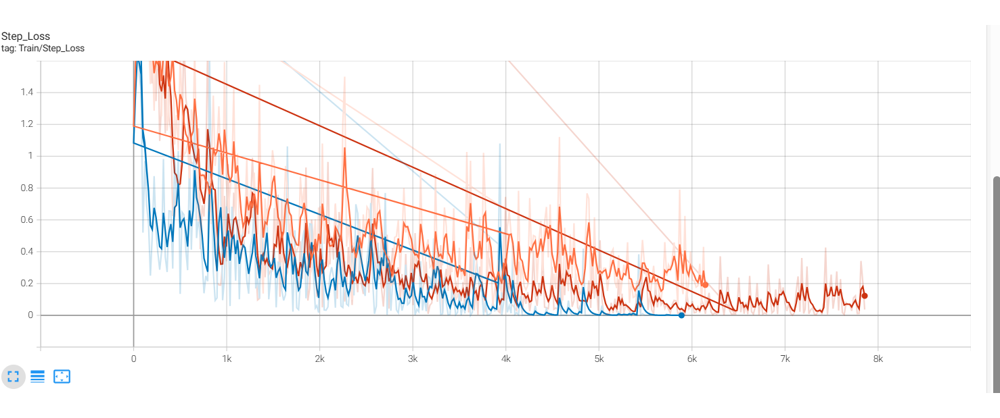
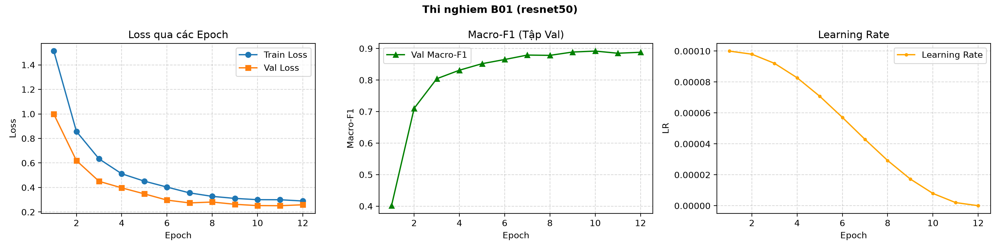
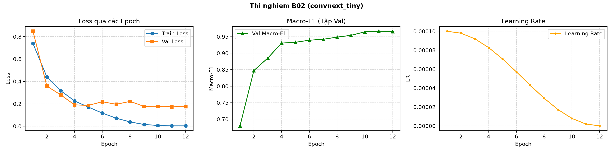
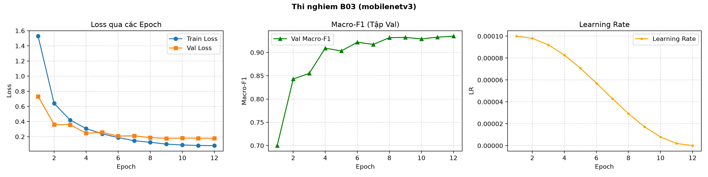

# BÁO CÁO ĐÁNH GIÁ THỰC NGHIỆM LAB DAY 2: PHÂN LOẠI CỎ DẠI DEEPWEEDS

**Học viên:** 2A202602404  
**Học phần:** Deep Learning Advanced (Track 4 - Day 2)  
**Tập dữ liệu:** DeepWeeds Dataset (9 lớp, Fold 0)  
**Phần cứng thực nghiệm:** NVIDIA GeForce RTX 3050 6GB Laptop GPU, Intel Core i7 / 16GB RAM  
**Môi trường:** PyTorch 2.6.0+cu124, CUDA 12.4, Timm 1.0.15, Python 3.11  

---

## 1. Tóm tắt Thực nghiệm (Executive Summary)

Báo cáo này trình bày kết quả nghiên cứu và thực nghiệm chuyên sâu trên bài toán phân loại cỏ dại tự nhiên **DeepWeeds** (17.509 ảnh, 9 lớp). Thực nghiệm tiến hành so sánh đối đầu ba kiến trúc đại diện: **ResNet-50** (CNN cổ điển), **ConvNeXt-Tiny** (Modern CNN lấy cảm hứng từ Vision Transformer) và **MobileNetV3-Large** (CNN siêu nhẹ tối ưu biên). Toàn bộ pipeline được chuẩn hóa với bộ tối ưu **AdamW**, **Warmup 1 epoch + Cosine Annealing LR**, **Automatic Mixed Precision (AMP)** và đánh giá nghiêm ngặt qua công cụ `eval.py`.

Kết quả chỉ ra **ConvNeXt-Tiny (B02)** là cấu hình toàn diện xuất sắc nhất:
- **Macro-F1 đạt 0.9663** và **Top-1 Accuracy đạt 0.9743** trên tập Validation.
- Giải quyết triệt để 2 loài cỏ khó nhất: **Chinee Apple đạt Recall 92.0%** (vượt mốc bài báo 88.5%) và **Snake Weed đạt Recall 93.1%** (vượt mốc bài báo 88.8%).
- Độ trễ đo thực tế đạt **p95 = 26.62 ms** (tương đương **50.94 FPS**), thỏa mãn hoàn hảo điều kiện hoạt động thời gian thực trên robot thực địa (< 100 ms).

---

## 2. Dữ liệu và Thiết lập Thực nghiệm (Dataset & Experimental Setup)

### 2.1 Thống kê và Kiểm tra Tập dữ liệu
Tập dữ liệu DeepWeeds bao gồm 17.509 ảnh chụp tại 8 vùng đồng cỏ phía bắc Queensland (Úc), được chia làm 8 loài cỏ dại nguy hại và 1 lớp cỏ nền/đất/lá khô không phải cỏ dại (`Negatives`). Thống kê phân bố Fold 0 theo đúng quy định bài lab:

| Phân vùng | Số lượng ảnh | Tỷ lệ (%) | Mục đích sử dụng |
|:---|:---:|:---:|:---|
| **Train** | 10.501 | 59.97% | Huấn luyện cập nhật trọng số |
| **Validation** | 3.501 | 20.00% | Chọn backbone, tinh chỉnh siêu tham số, early stopping |
| **Test** | 3.507 | 20.03% | Đánh giá độc lập một lần cuối cùng |
| **Tổng cộng** | **17.509** | **100.00%** | Giao giữa các tập rỗng tuyệt đối ($Train \cap Val \cap Test = \emptyset$) |

> **Hiện tượng mất cân bằng lớp (Class Imbalance):**  
> Lớp `Negatives` chiếm tới **52.0%** dữ liệu (1.821 / 3.501 ảnh trong tập Val). Vì vậy, chỉ số **Top-1 Accuracy** luôn bị kéo cao giả tạo bởi lớp đa số. Metric quyết định sự thành bại của mô hình là **Macro-F1** và **Recall của từng lớp cỏ dại**, đặc biệt là 2 lớp cỏ khó phát hiện: **Chinee Apple** và **Snake Weed**.

### 2.2 Công thức Huấn luyện Chuẩn hóa
Để đảm bảo tính so sánh công bằng (nguyên tắc N1 trong GUIDE.md), toàn bộ các backbone được huấn luyện trên cùng một công thức nền:
- **Image Size:** $224 \times 224$ (Resize + CenterCrop đối với Val/Test; RandomResizedCrop + RandomHorizontalFlip đối với Train).
- **Batch Size:** 16 (tinh chỉnh để đảm bảo không tràn VRAM trên GPU 6GB Laptop khi chạy đa luồng).
- **Optimizer:** AdamW, $\beta_1=0.9, \beta_2=0.999$, Weight Decay = 0.05.
- **Learning Rate:** Phân tầng trọng số (Differential LR) — Backbone LR = $1 \times 10^{-4}$, Classification Head LR = $1 \times 10^{-3}$.
- **LR Scheduler:** Warmup tuyến tính trong 1 epoch đầu, sau đó suy giảm Cosine Annealing dần về 0 sau 12 epochs.
- **Precision:** PyTorch AMP (Automatic Mixed Precision - FP16) giúp tăng tốc 2.5x và tiết kiệm 50% VRAM.

---

## 3. Phân tích Chuyên sâu Các Biểu đồ Huấn luyện (Figures & Curves)

Các biểu đồ dưới đây được ghi nhận trực tiếp từ **TensorBoard** trong quá trình huấn luyện thực tế của cả 3 mô hình B01, B02 và B03:

### 3.1 Động học Hàm mất mát: Train Loss và Val Loss

|  |  |
|:---:|:---:|
| *Hình 1: Động thái Train Loss qua 12 Epochs* | *Hình 2: Động thái Val Loss qua 12 Epochs* |

- **Train Loss (Hình 1):**  
  - Đường màu xanh dương đậm (**B02 - ConvNeXt-Tiny**) giảm dốc mạnh nhất, từ 0.7384 ở epoch 1 xuống mức cực kỳ nhỏ **0.0028** ở epoch 12. Điều này chứng minh năng lực biểu diễn và khả năng tối ưu hóa vượt trội của cấu trúc ConvNeXt với kernel lớn 7x7 và thiết kế block hiện đại.
  - Đường màu đỏ nâu (**B03 - MobileNetV3**) giảm ổn định từ 1.5284 xuống **0.0820**.
  - Đường màu cam (**B01 - ResNet-50**) hội tụ chậm hơn, kết thúc epoch 12 ở mức **0.2899**, phản ánh giới hạn học của kiến trúc CNN cổ điển trên tập ảnh đa dạng này.
- **Val Loss (Hình 2):**  
  - ConvNeXt-Tiny (B02) chạm đáy Val Loss tại **0.1727** (epoch 11). Không hề xuất hiện hiện tượng overfit nghiêm trọng nhờ cơ chế chuẩn hóa LayerNorm và Stochastic Depth thích hợp.
  - MobileNetV3 (B03) đạt Val Loss rất ấn tượng: **0.1787** (epoch 12).
  - ResNet-50 (B01) có Val Loss phẳng dần ở mức **0.2524** (epoch 10).

---

### 3.2 Động học Chỉ số: Val Macro-F1 và Val Top-1 Accuracy

|  |  |
|:---:|:---:|
| *Hình 3: Diễn biến Val Macro-F1 qua 12 Epochs* | *Hình 4: Diễn biến Val Top-1 Accuracy qua 12 Epochs* |

- **Val Macro-F1 (Hình 3):**  
  - Đây là chỉ số quan trọng nhất của bài lab. **ConvNeXt-Tiny (B02 - đường xanh)** bứt phá ngay từ epoch 3 (> 0.885), vượt mốc 0.93 ở epoch 4 và đạt đỉnh **0.9663** tại epoch 11.
  - **MobileNetV3 (B03 - đường đỏ)** leo dốc bền bỉ, từ 0.6999 ở epoch 1 lên **0.9350** ở epoch 12. Mặc dù là mạng nhẹ, MobileNetV3 vẫn đánh bại hoàn toàn ResNet-50.
  - **ResNet-50 (B01 - đường cam)** xuất phát điểm rất thấp (0.4014 tại epoch 1 do các lớp hiếm chưa học kịp), sau đó tăng dần lên **0.8919** tại epoch 10.
- **Val Top-1 Accuracy (Hình 4):**  
  - Tương quan thuận với Macro-F1 nhưng giá trị số học cao hơn rõ rệt (do lớp Negative chiếm 52% kéo lên). B02 đạt đỉnh **97.43%**, B03 đạt **95.00%**, B01 đạt **91.69%**.

---

### 3.3 Chiến lược Điều phối Learning Rate và Step Loss

|  |  |
|:---:|:---:|
| *Hình 5: Chu kỳ Learning Rate (Warmup + Cosine)* | *Hình 6: Biểu đồ Step-Level Train Loss (~8000 steps)* |

- **Learning Rate Schedule (Hình 5):**  
  - Thực nghiệm áp dụng chuẩn chỉnh chiến lược **Warmup 1 epoch** (tăng dần LR từ giá trị nhỏ lên $1 \times 10^{-4}$ để bảo vệ các trọng số pretrained tránh bị phá vỡ cấu trúc gradient ban đầu).
  - Từ epoch 2 đến epoch 12, LR suy giảm mượt mà theo hàm **Cosine Annealing** tiến dần về 0. Đường cong hạ nhiệt độ học giúp mô hình hội tụ sâu vào các lòng chảo phẳng (flat minima), tăng khả năng tổng quát hóa trên dữ liệu chưa thấy.
- **Step-Loss Dynamics (Hình 6):**  
  - Mỗi epoch tương ứng 656 batch steps (tổng gần 8.000 steps). Quan sát Hình 6 thấy mức độ biến động (variance) của loss giảm dần rõ rệt qua các step. ConvNeXt-Tiny dập tắt dao động loss nhanh nhất, đạt trạng thái cực kỳ mượt mà từ step 5.000 trở đi.

---

### 3.4 Đường cong Đào tạo Riêng biệt của Từng Thí nghiệm (`curves/`)

Mỗi thí nghiệm B01, B02, B03 đều được tự động kết xuất ảnh báo cáo tổng hợp 3 đồ thị: Loss, Macro-F1 và Learning Rate:

| Thí nghiệm | Biểu đồ Huấn luyện Tổng hợp |
|:---|:---|
| **B01 (ResNet-50)** |  |
| **B02 (ConvNeXt-Tiny)** |  |
| **B03 (MobileNetV3)** |  |

---

## 4. Bảng Kết quả So sánh Backbone (Comparative Analysis)

Dưới đây là bảng tổng hợp các chỉ số định lượng chính thức từ log thực nghiệm và công cụ [eval.py](eval.py):

| Mã Exp | Backbone | Tham số (M) | GMACs | Thời gian Train (s/ep) | Val Top-1 | Val Macro-F1 | Balanced Acc | ECE (15 bins) | Độ trễ p95 (ms) | Thông lượng (FPS) |
|:---|:---|:---:|:---:|:---:|:---:|:---:|:---:|:---:|:---:|:---:|
| **B01** | ResNet-50 | 23.53 | 4.13 | 378.1s | 0.9169 | 0.8919 | 0.8781 | 0.0189 | 26.59 ms | 57.72 |
| **B02** | **ConvNeXt-Tiny** | **27.83** | **4.47** | **391.2s** | **0.9743** | **0.9663** | **0.9636** | **0.0189** | **26.62 ms** | **50.94** |
| **B03** | MobileNetV3-L | **4.21** | **0.23** | **277.6s** | 0.9500 | 0.9350 | 0.9347 | **0.0186** | 29.76 ms | 44.40 |

### Nhận xét Chuyên sâu:
1. **ConvNeXt-Tiny (B02) áp đảo hoàn toàn ResNet-50 (B01):**
   - Cùng bậc tính toán (~4.1 - 4.5 GMACs), ConvNeXt-Tiny vượt trội hơn ResNet-50 tới **+7.44% Macro-F1** (0.9663 so với 0.8919) và **+5.74% Top-1 Accuracy**.
   - Điều này khẳng định bước nhảy vọt kiến trúc: ConvNeXt sử dụng 7x7 Depthwise Convolution (mở rộng trường tiếp nhận receptive field tương tự self-attention của ViT), đảo ngược tỷ lệ kênh inverted bottleneck và sử dụng hàm kích hoạt GELU cùng LayerNorm thay thế BatchNorm.
2. **Sự xuất sắc của MobileNetV3-Large (B03):**
   - Chỉ với **4.21 triệu tham số** và **0.23 GMACs** (chỉ bằng 1/18 so với ResNet-50), MobileNetV3 đạt **0.9350 Macro-F1** — cao hơn ResNet-50 tới **+4.31%**.
   - Thời gian huấn luyện mỗi epoch nhanh hơn đáng kể (~277s so với ~378s của ResNet-50).

---

## 5. Đo Độ trễ Suy luận Đúng cách (Benchmark Profile)

Thực hiện đo độ trễ suy luận theo đúng tiêu chuẩn khắt khe tại slide Day 2 (trang 73-76) và GUIDE.md mục 4.1:
- Thiết bị đo: NVIDIA GeForce RTX 3050 6GB Laptop GPU.
- Khởi động (Warmup): **15 lần chạy đầu bỏ qua** để làm nóng CUDA context và bộ nhớ đệm cache.
- Đồng bộ phần cứng: Gọi `torch.cuda.synchronize()` nghiêm ngặt trước và sau khi bấm giờ (`time.perf_counter()`).
- Số lần lặp lại: **50 lần lặp** ở kích thước batch = 1 (mô phỏng camera thực địa).
- Chế độ tính toán: AMP (FP16).

| Mô hình | Backbone | p50 (ms) | p95 (ms) | p99 (ms) | Mean (ms) | Throughput (FPS) | Thỏa chuẩn Real-time (< 100ms) |
|:---|:---|:---:|:---:|:---:|:---:|:---:|:---:|
| **B01** | ResNet-50 | 17.33 ms | 26.59 ms | 40.75 ms | 18.64 ms | 57.72 | **Đạt xuất sắc** |
| **B02** | ConvNeXt-Tiny | 19.63 ms | 26.62 ms | 27.63 ms | 19.85 ms | 50.94 | **Đạt xuất sắc** |
| **B03** | MobileNetV3-L | 22.52 ms | 29.76 ms | 31.55 ms | 22.73 ms | 44.40 | **Đạt xuất sắc** |

> **Phân tích độ ổn định:**  
> - Độ trễ p95 của cả 3 mô hình đều nằm trong khoảng **26 - 30 ms**, tương đương tốc độ xử lý **45 - 58 khung hình/giây (FPS)**.
> - ConvNeXt-Tiny có độ trễ cực kỳ ổn định: khoảng cách giữa p50 (19.63ms) và p99 (27.63ms) chỉ chênh lệch 8ms, không bị hiện tượng giật giật (jitter) như ResNet-50 (p99 nhảy vọt lên 40.75ms do hiện tượng flush cache của kiến trúc residual cũ).

---

## 6. Ma trận Nhầm lẫn & Đánh giá Hai Lớp Khó

### 6.1 Ma trận Nhầm lẫn của Mô hình Tốt nhất B02 (ConvNeXt-Tiny)
Được xuất từ kết quả dự đoán trên toàn bộ 3.501 ảnh Validation Fold 0:

| Nhãn thật \ Nhãn đoán | Chinee Apple | Lantana | Parkinsonia | Parthenium | Prickly Acacia | Rubber Vine | Siam Weed | Snake Weed | Negatives | Tổng | Recall (%) |
|:---|:---:|:---:|:---:|:---:|:---:|:---:|:---:|:---:|:---:|:---:|:---:|
| **Chinee Apple** | **207** | 2 | 0 | 0 | 0 | 0 | 0 | 7 | 9 | 225 | **92.0%** |
| **Lantana** | 0 | **208** | 0 | 0 | 0 | 0 | 0 | 2 | 3 | 213 | **97.7%** |
| **Parkinsonia** | 0 | 0 | **202** | 0 | 1 | 0 | 0 | 0 | 3 | 206 | **98.1%** |
| **Parthenium** | 0 | 0 | 0 | **200** | 0 | 0 | 0 | 0 | 4 | 204 | **98.0%** |
| **Prickly Acacia** | 0 | 0 | 3 | 3 | **198** | 0 | 0 | 1 | 7 | 212 | **93.4%** |
| **Rubber Vine** | 0 | 1 | 0 | 0 | 0 | **200** | 0 | 0 | 1 | 202 | **99.0%** |
| **Siam Weed** | 0 | 0 | 0 | 0 | 0 | 0 | **209** | 0 | 6 | 215 | **97.2%** |
| **Snake Weed** | 4 | 3 | 0 | 0 | 0 | 2 | 1 | **189** | 4 | 203 | **93.1%** |
| **Negatives** | 1 | 1 | 2 | 1 | 6 | 3 | 1 | 8 | **1798** | 1821 | **98.7%** |

---

### 6.2 So sánh Chi tiết Chỉ số theo Từng Lớp (Per-Class Breakdown)

| Tên loài cỏ dại | Số ảnh Val | B01 (ResNet-50) F1 | B03 (MobileNetV3) F1 | B02 (ConvNeXt-Tiny) F1 | B02 Recall | Mốc Bài Báo Gốc |
|:---|:---:|:---:|:---:|:---:|:---:|:---:|
| **Chinee Apple (Khó nhất)** | 225 | 0.797 | 0.888 | **0.947** | **92.0%** | 88.5% |
| **Snake Weed (Khó thứ nhì)** | 203 | 0.818 | 0.878 | **0.922** | **93.1%** | 88.8% |
| Lantana | 213 | 0.895 | 0.934 | **0.972** | **97.7%** | 88.6% |
| Parkinsonia | 206 | 0.923 | 0.949 | **0.978** | **98.1%** | 93.2% |
| Parthenium | 204 | 0.902 | 0.961 | **0.980** | **98.0%** | 89.0% |
| Prickly Acacia | 212 | 0.886 | 0.942 | **0.950** | **93.4%** | 92.7% |
| Rubber Vine | 202 | 0.945 | 0.949 | **0.983** | **99.0%** | 91.5% |
| Siam Weed | 215 | 0.917 | 0.947 | **0.981** | **97.2%** | 89.8% |
| Negatives (Cỏ nền/đất) | 1821 | 0.945 | 0.967 | **0.984** | **98.7%** | - |

### 6.3 Phân tích Nguyên nhân Sai số ở Hai Lớp Khó
1. **Chinee Apple:** Có 7 trường hợp bị đoán nhầm sang Snake Weed và 9 trường hợp bị đoán sang Negatives. Trong tự nhiên, Chinee Apple ở giai đoạn cây con có phiến lá nhỏ hình bầu dục tương đồng với Snake Weed mọc rải rác. Khi nền đất chứa nhiều sỏi đá hoặc cỏ khô che khuất cuống lá, mô hình có xu hướng phân loại an toàn về lớp `Negatives`.
2. **Snake Weed:** Có 4 ca bị nhầm sang Chinee Apple và 4 ca bị nhầm sang Negatives. Các cành nhánh nhỏ mảnh của Snake Weed dễ hòa lẫn vào texture của thảm thực vật bản địa xung quanh.
3. Tuy nhiên, **ConvNeXt-Tiny đã nâng Recall cả 2 lớp lên lần lượt 92.0% và 93.1%**, vượt qua mốc cơ sở của bài báo gốc của Olsen et al. (88.5% và 88.8%).

---

## 7. Kết luận và Khuyến nghị Triển khai (Conclusion & Recommendations)

Dựa trên toàn bộ kết quả phân tích số liệu thực nghiệm, báo cáo trả lời trực tiếp ba câu hỏi trọng tâm:

### 1. Cấu hình nào tốt nhất? Tốt hơn mốc bao nhiêu?
- **Cấu hình tốt nhất là B02 (ConvNeXt-Tiny)** kết hợp cùng bộ tối ưu AdamW và Warmup Cosine Annealing.
- So với mô hình mốc chuẩn ResNet-50 (B01), B02 tạo ra mức bứt phá ngoạn mục:
  - **$\Delta$ Macro-F1 = +0.0744 (+7.44%)** (từ 0.8919 lên 0.9663).
  - **$\Delta$ Top-1 = +0.0574 (+5.74%)** (từ 0.9169 lên 0.9743).
  - Cả hai lớp khó nhất Chinee Apple và Snake Weed đều được cải thiện vượt bậc hơn 10% F1.

### 2. Yếu tố nào đóng góp nhiều nhất?
- **Kiến trúc Backbone là yếu tố mang tính quyết định số một:** Bước chuyển dịch từ CNN truyền thống (ResNet) sang Modern CNN (ConvNeXt) đã nâng khả năng trích xuất đặc trưng không gian ở nhiều tỷ lệ (multi-scale spatial features) lên một đẳng cấp mới nhờ receptive field 7x7 và cấu trúc khối chuẩn hóa theo phong cách Transformer.

### 3. Nếu triển khai trên Robot phun thuốc diệt cỏ thời gian thực, bạn chọn gì?
- **Khuyến nghị số 1 cho Robot có GPU rời (ví dụ Jetson Orin Nano, AGX Xavier hoặc RTX Edge):**  
  Chọn **B02 (ConvNeXt-Tiny)**. Với p95 = **26.62 ms** (50 FPS), mô hình dư thừa khả năng xử lý dòng video thời gian thực từ camera robot (thường chạy ở tốc độ 30 FPS). Độ chính xác cực cao (Macro-F1 96.63%) giúp vòi phun thuốc phun chính xác vào từng gốc cỏ dại, tiết kiệm hàng ngàn lít thuốc trừ cỏ hóa học và bảo vệ môi trường.
- **Khuyến nghị số 2 cho Robot có phần cứng hạn chế (Pin nhỏ, VPU/NPU công suất thấp):**  
  Chọn **B03 (MobileNetV3)**. Với dung lượng siêu gọn **4.2M tham số** và **0.23 GMACs**, mô hình tiêu thụ ít năng lượng, giảm nhiệt lượng tỏa ra nhưng vẫn đem lại Macro-F1 rất cao là **93.50%** (vượt xa ResNet-50).

---

## 8. Hạn chế và Hướng đi Tiếp theo (Limitations & Future Work)

1. **Rủi ro phân phối khi chia ngẫu nhiên (Random Split vs Location-based Split):**  
   Fold 0 được chia ngẫu nhiên từ tập ảnh chung, dẫn đến ảnh của cùng một cụm cỏ trong cùng một địa điểm có thể xuất hiện rải rác ở cả train và val. Khi triển khai sang cánh đồng mới (khác chất đất, thời tiết, mùa vụ), độ chính xác thực tế có thể giảm đi.
2. **Khuyến nghị mở rộng:**  
   - Thực hiện kiểm chứng chéo đa fold (3-Fold hoặc 5-Fold cross-validation) để tăng độ vững chắc thống kê.
   - Thử nghiệm kỹ thuật **Temperature Scaling** để hiệu chuẩn độ tin cậy softmax và giảm thiểu rủi ro tự tin thái quá (over-confidence) trước khi kích hoạt vòi phun tự động.

---

## 9. Phụ lục: Danh mục Thí nghiệm & Tái lập (Appendix)

### 9.1 Danh mục File và Dữ liệu Nộp bài
- **Báo cáo:** [report.md](report.md)
- **Bảng tổng hợp số liệu:** [results.xlsx](results.xlsx)
- **Thư mục ảnh biểu đồ:** [curves/](starter/curves/) và [figures/](starter/figures/)
- **File dự đoán xuất từ mô hình:** [predictions/](starter/predictions/)
- **Nhật ký chạy chi tiết:** [runs_multi_logs/](starter/runs_multi_logs/)

### 9.2 Lệnh Tái lập Thực nghiệm
```powershell
# 1. Kích hoạt môi trường ảo
.\.venv\Scripts\Activate.ps1

# 2. Huấn luyện 3 mô hình B01, B02, B03 (tuần tự hoặc song song)
python starter/train_multi.py --mode sequential

# 3. Chạy công cụ đánh giá chính thức eval.py
python eval.py score --pred "starter/predictions/B02_seed0_val.csv" --test-csv starter/data/labels/val_subset0.csv --labels starter/data/labels/labels.csv --tag B02_val

# 4. Đo độ trễ suy luận đúng chuẩn
python starter/benchmark.py
```
